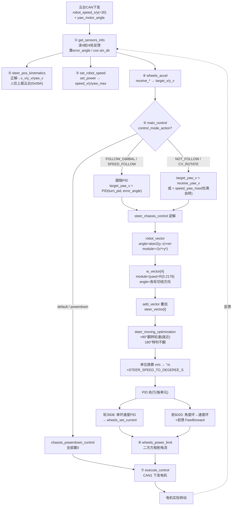

# 舵轮哨兵底盘 STM32 控制板 — 项目架构文档

> 阅读范围：Task/、User/app、User/peripheral、User/motor、User/tools、User/config、Algorithm/，以及根目录若干 markdown 设计文档。
> 本文档**不修改任何代码**，仅梳理现有工程结构、运行逻辑与关键数据结构。

---

## 0. 项目概览

| 项 | 说明 |
|----|------|
| 硬件平台 | STM32F4 系列（平衡步兵 / 哨兵底盘控制板），FreeRTOS 实时系统 |
| 当前机型 | `#define ROBOT TIGER`（复活赛舵轮哨兵，见 `robot_config.h`） |
| 底盘类型 | `STEER_WHEEL`（舵轮，**本机**）/ `MECANUM_WHEEL`（麦轮）/ `OMNI_WHEEL`（全向轮） |
| 云台 yaw 电机 | `YAW_DM_MOTOR`（本机）/ `YAW_GM6020` |
| 核心目标 | 底盘运动控制、舵轮逆/正运动学解算、功率限制、超级电容能量管理、裁判系统对接、与云台板的板间 CAN 通信、遥控/键鼠输入解析 |

> 关键事实：**底盘跟随所需的 yaw 角来自云台板通过 CAN 下发的 `gimbal_receiver_pack1.yaw_motor_angle`，而不是本板 IMU**。本板的 `INS_Task`（姿态解算）所在的 `ChasisEstimate_task` 在任务创建中已被注释，当前构建下并未作为独立任务运行。

---

## 1. 代码架构（分层）

```
Chassis/
├── main.c (User/src/app)            ← 程序入口：BSP_Init → Robot_Init → startTask → 调度
├── Task/                            ← FreeRTOS 任务层（调度/控制/功率/裁判/云台/离线/调试）
│   ├── src/  *.c   inc/  *.h
├── User/                            ← 应用层（最核心的业务代码）
│   ├── src/app  & inc/app          ← 控制器、运动学、解算器、电容、裁判转发
│   ├── src/peripheral & inc/peripheral ← 外设驱动（IMU/INA260/电容/裁判/遥控）
│   ├── src/motor & inc/motor       ← 电机驱动（GM6020/M3508/M2006）
│   ├── src/tools & inc/tools       ← 工具（滤波/零点检测/调试/协议）
│   ├── src/sys & inc/sys           ← 启动/系统/中断
│   ├── inc/config                  ← 机器人/底盘/CAN 配置宏
│   ├── inc/os                      ← FreeRTOSConfig
│   └── inc/FATFS                   ← 文件系统（SD 卡日志）
├── Algorithm/                      ← 通用算法库（PID/滤波/EKF/系统辨识/CRC…）
├── Mylib/                          ← 板级驱动库（CAN 收发、裁判串口 bsp_referee、counter）
├── Library/                        ← 第三方库（FreeRTOS、FATFS、SEGGER_RTT）
├── FreeRTOS/                       ← FreeRTOS 内核源码
├── docs/                           ← 参考文档（PDF）
└── *.md                            ← 设计说明文档（功率/电容、裁判系统、云台对接等）
```

**分层职责**

| 层 | 目录 | 职责 |
|----|------|------|
| 启动/系统层 | `User/src/sys` | 向量表 `startup_stm32f40_41xxx.s`、时钟 `system_stm32f4xx.c`、中断 `stm32f4xx_it.c` |
| 板级驱动库 | `Mylib/` | `can1/can2/can_send/can_receive`（CAN 收发与中断解码）、`bsp_referee`（裁判 UART+DMA） |
| 算法库 | `Algorithm/` | 与硬件无关的通用算法（PID、滤波、四元数 EKF、观测器、系统辨识、TD、CRC…） |
| 应用层 | `User/` | 控制算法、外设驱动、电机驱动、配置 |
| 任务层 | `Task/` | FreeRTOS 任务编排与调度 |
| 第三方 | `Library/`、`FreeRTOS/` | 操作系统、文件系统、RTT 调试 |

---

## 2. FreeRTOS 任务一览

任务在 `Task/src/Start_Task.c` 中统一创建（`start_task` 在临界区内 `xTaskCreate`，然后 `vTaskDelete` 自身）。

| 任务 | 优先级 | 周期 | 源文件 | 职责 |
|------|--------|------|--------|------|
| `start_task` | 1 | 一次性 | `Start_Task.c` | 创建所有任务 + 事件组，随后自删 |
| `ChasisControl_task` | 9 | **1 ms** | `ChasisControlTask.c` | **底盘主控循环**：传感→运动学→功率→执行 |
| `PowerControlTask` | 3 | **1 ms** | `PowerControlTask.c` | 功率/电容策略：读裁判功率上限→`NingCapControl`→下发电容板 |
| `Refereetask` | 3 | **10 ms** | `RefereeTask.c` | 裁判系统解包 `Referee_UnpackFifoData`；每 500ms 上报哨兵决策 |
| `GimbalTask` | 15 | **5 ms** | `GimbalTask.c` | `HeatUpdate()` + `JudgeDataCanSend()`（向云台转发裁判/速度/坐标数据的总调度） |
| `Offline_task` | 17 | **1 s** | `Offline_Task.c` | 检测 6020/3508 电机、板间通信、电容板、遥控是否离线 |
| `BlueToothTask` | 9 | **20 ms** | `BlueToothTask.c` | 通过蓝牙（VOFA 风格）上传调试浮点数据 |
| `Iwdg_task` | 18 | 事件触发 | `iwdgTask.c` | 看门狗：等待 `TASK_BIT_ALL` 全部置位后喂狗（2s 超时） |
| `CPU_task` | 2 | 1 s | `CPU_Task.c` | 仅 `DEBUG_MODE_FREERTOS` 下编译：打印任务栈/CPU 占用 |

> 条件编译/已注释掉的任务：
> - `ChasisEstimate_task`（INS 姿态，已注释，未运行）
> - `Action_task`（原 `Gimbal_msgs_Decode1` 调用者，已注释；**云台包解码现由 CAN 接收中断接管**）
> - `SDCard_task`（SD 卡日志，已注释）
> - `WheelsAccelFusion_task`（轮加速度融合，已注释）
> - `Test_task` / `MF9025_IdentifyTask`（仅 `TEST_TASK_ON` / `MF9025_IDENTIFY_ON` 时替换主控）

**看门狗机制**：每个运行中的任务在循环末尾 `xEventGroupSetBits(xCreatedEventGroup, XXX_BIT)` 置位自己的事件位；`Iwdg_task` 用 `xEventGroupWaitBits(..., TASK_BIT_ALL, ...)` 等待全部任务都"活着"才 `IWDG_Feed()`，否则 2s 后复位。

---

## 3. 控制逻辑脉络

### 3.1 主控循环 `ChasisControl_task`（1 kHz）

```
get_sensors_info()          // 解码 GM6020(舵)/M3508(轮) 反馈；算跟随角 error_angle、底盘-云台夹角 sin/cos
   │
   ├─[舵轮] steer_pos_kinematics()   // 正运动学：由舵角+轮速反解底盘实际 x_v / y_v / yaw_v
   │
   ├─ set_robot_speed()      // set_power = cap_controller.set_power；由功率推算速度上限 speed_x/y/yaw_max
   ├─ wheels_accel()         // 赋值 target_x_v/y_v/yaw_v（当前直接取 receive 值，TD 暂未启用）
   ├─ main_control()         // 按控制模式做运动学解算 → 各电机目标电流
   ├─ wheels_power_limit()   // 功率限制核心：按电机模型削减电流
   └─ execute_control()      // 打包 GM6020(舵) + M3508(轮) CAN 帧并发送
        │
        └─ xEventGroupSetBits(CHASIS_CONTROL_BIT)   // 喂看门狗事件位
```

### 3.2 模式分发 `main_control`

根据 `remote_controller.control_mode_action` 分发，默认进入 `chassis_powerdown_control`（断电停车）：

| 模式 | 含义 | 调用 |
|------|------|------|
| `FOLLOW_GIMBAL` | 云台跟随 | `chassis_follow_control` |
| `NOT_FOLLOW_GIMBAL` | 仅底盘运动 | `chassis_not_follow_control` |
| `CV_ROTATE` | 恒速小陀螺 | `chassis_rotate_control` |
| `SPEED_FOLLOW` | 速度矢量跟随 | `chassis_speed_follow_control` |

每个函数再按 `infantry.chassis_type` 分流到 `steer_chassis_control` / `mecanum_*_control` / `omni_*_control`。

### 3.3 舵轮运动学（核心算法）

**逆运动学 `steer_chassis_control()`**：
1. 跟随模式：用 `turn_pid` 根据 `error_angle`（云台 yaw 与机械零点夹角）求出旋转角速度 `target_yaw_v`；`SPEED_FOLLOW` 模式另有速度矢量跟随优化。
2. 由 `target_x_v / target_y_v` 计算平动向量 `robot_vector`（模值 + 角度）。
3. 旋转向量 `w_vector[i]`：4 个舵轮的切线方向（安装角 ±90°）叠加。
4. 对每个轮：`steer_vector[i] = add_vector(robot_vector, w_vector[i])`（向量相加）。
5. `steer_moving_optimization(i)`：选最短转向路径，以 80°/100°迟滞决定轮组翻转，并按舵角误差限制轮速。
6. PID 计算：
   - 3508 轮速：`wheels_pid[i]`（速度 PID，`steer_vector.module` 为设定）
   - 6020 舵向：角度 PID `steers_angle_pid[i]`（经 TD 滤波）→ 速度设定点 → 速度 PID `steers_speed_pid[i]` + 前馈 `Steer_6020_FF`

**正运动学 `steer_pos_kinematics()`**（与逆解对称）：
- 由 4 个舵轮的物理线速度 + 舵角，平均得平动分量，再投影得 yaw 分量 → 输出 `infantry.x_v / y_v / yaw_v`（底盘坐标系 → 云台坐标系），回传给云台板。

### 3.4 输入来源（指令从哪来）

```
云台板 ──CAN2 0x150 (GimbalReceivePack1)──► CAN RX 中断 (Mylib/can_receive.c)
                                            └─► Gimbal_msgs_Decode1()
                                                   ├─ 设置 remote_controller 各状态(模式/射击/电容/飞坡…)
                                                   └─ infantry.receive_x_v/y_v/yaw_v = pack.robot_speed_*/系数

云台板 ──CAN2 0x151 (GimbalReceivePack2)──► 中断 ─► Gimbal_msgs_Decode2()  → 哨兵坐标 sentry_coord_x/y_cm

遥控/键鼠（本机 DJI 接收，当前主要走云台板下发）:
   ChassisSolver.c: get_control_info() → DJIKeyMouseUpdate / DJIRemoteUpdate
   设置 chassis_solver.chassis_speed_x/y/w 与各种模式切换
```

> 即：底盘的"大脑"在云台板/上位机，底盘板负责接收指令、做运动学解算与电机执行。

### 3.5 功率控制（策略层 + 执行层 双层）

- **策略层 `PowerControlTask`（1 kHz）**：读取裁判系统 `chassis_power_limit`（限幅 30~200W），结合 `remote_controller.fly_state`（飞坡）、`super_power_state`（电容主动）、`gimbal_receiver_pack1.through_hole_flag`（过孔）选择策略，调用 `NingCapControl()`：
  - `getCapEnergy()` 由电容电压算剩余能量；
  - `RefereeOutputControl()` 按缓冲能量三级状态机设 `cap_power`（电容充电功率）；
  - `ChassisOutputControl()` 按电容电压三级状态机设 `cap_controller.set_power`（底盘可用功率）。
  - 每 4 ms 通过 CAN 向电容板（0x050）发送 `{P_ref, buffer_energy}`。
- **执行层 `wheels_power_limit()`（在 1 kHz 主控内）**：基于电机功率模型 `P = I²R + K·ω·I + B·ω² + P0`，当预测总功率 > `set_power` 时，对每电机解二次方程求电流缩放系数 `send_torque_lower_scale`（0~1），直接乘到发送电流上。舵轮底盘采用**功率优先分配**：舵电机先拿 `set_power × 1.4`，轮电机拿剩余（保底 20%），优先保证转向跟踪。

（详见根目录 `功率控制与超级电容代码分析.md`）

---

## 4. 通信架构

### 4.1 物理总线

| 总线 | 用途 | 关键 ID |
|------|------|---------|
| **CAN1** | 底盘电机 | 3508 收/发 `0x201~0x204`；6020 收/发 `0x205~0x208`（舵轮） |
| **CAN2** | 云台通信 + 电容板 + SentryCmd | 见下表 |
| **UART4** (PC10/11, 115200) | 裁判系统串口 | DMA 环形缓冲 4096B，双层 CRC 解帧 |
| **蓝牙/VOFA** | 调试数据上传 | `BlueToothTask` 每 20ms |

### 4.2 CAN2 帧表（`can_config.h`，机型 TIGER）

| 方向 | ID | 内容 |
|------|-----|------|
| 收 | `0x150` | 云台→底盘 指令包1（状态/模式/yaw角/速度） |
| 收 | `0x151` | 云台→底盘 哨兵坐标（上位机定位，cm） |
| 收 | `0x051` | 电容板反馈（电压/功率） |
| 收 | `0x15A` | 云台转发的 SentryCmd（小地图 0x0303） |
| 发 | `0x160` | 底盘→云台 控制指令（射击权限/阵营/电容电压/弹速） |
| 发 | `0x094` / `0x096` | 裁判数据 1 / 2 |
| 发 | `0x097` | 全场血量 |
| 发 | `0x098` | RFID / BUFF |
| 发 | `0x099` | 全场位置（10 帧轮询：5 友+5 敌，IDs 1/2/3/4/7） |
| 发 | `0x09A` | 底盘速度（正运动学反解结果） |
| 发 | `0x09B` | 射击数据（0x0207） |
| 发 | `0x09C` | 哨兵信息（0x020D）；`sentry_info_2` 的 bit15 已更名 `sentry_is_enhanced_posture`（强化姿态标志，2026-07-13 协议更新） |
| 发 | `0x09D` | 弹量扩展（0x0208 + RFID2） |
| 发 | `0x09E` | 小地图下发指令（0x0303，来自裁判系统） |
| 发 | `0x09F` | 哨兵姿态时长（0x020D 新增 `sentry_posture_duration`，8 字节，2026-07-13 协议更新） |
| 发 | `0x0A0` | 伤害值差（`damage_difference`，来自 0x0003，2026-07-13 协议更新） |
| 发 | `0x0A1` / `0x0A2` / `0x0A3` | `MotorOffline` / `UwbSteer` / `OutpostHP`：**发送函数已定义但 `JudgeDataCanSend` 未调度**（云台侧已配滤波器与解码，详见 `通信链路完整梳理.md` §9.2.4） |

> 上述 CAN2 发送由 `GimbalTask` → `JudgeDataCanSend()` 按 5ms 节拍 + 不同分频统一调度（详见 `GimbalSend.c`）。裁判系统对接的协议细节（UART 帧格式、cmd_id 枚举、0x0301 双向通道、哨兵决策 0x0120 上报）见根目录 `裁判系统通信架构解析.md`；0x0303 小地图指令的 CAN 封装见 `0x0303_CAN接口_云台对接.md`。

---


## 5. User/ 与 Algorithm/ 文件清单（按名识义）

### User/app（应用算法）
| 文件 | 用途 |
|------|------|
| `main.c` | 入口：BSP/机器人初始化、建任务、起调度 |
| `ChasisController.c/.h` | 底盘控制器：状态机、传感解码、功率限制入口、执行发送、跟随角计算 |
| `ChassisSolver.c/.h` | 输入解算：遥控/键鼠/蓝牙 → 速度指令与模式切换 |
| `steer.c/.h` | 舵轮逆/正运动学、舵向最优旋转、PID 初始化、调试方波 |
| `mecanum.c/.h` / `omni.c/.h` | 麦轮 / 全向轮运动学 |
| `ins.c/.h` | 姿态解算（INS，当前任务已注释） |
| `NingCap.c/.h` | 宁王超级电容控制器（功率/电压状态机） |
| `PowerLimit.c/.h` | 通用功率限制算法（二次方程法） |
| `HeatControl.c/.h` | 热量/射击控制 |
| `RotateSpeedEstimate.c/.h` | 转速估计 |
| `GimbalReceive.c/.h` | 云台→底盘 指令/坐标 解码 |
| `GimbalSend.c/.h` | 底盘→云台 裁判/速度/坐标/指令 打包与 CAN 发送调度 |

### User/peripheral（外设驱动）
| 文件 | 用途 |
|------|------|
| `remote_control.c/.h` | 遥控器/键鼠/蓝牙 接收与解析 |
| `Referee.c/.h` | 裁判系统串口解包、数据分发、UI/决策上报 |
| `icm20602.c/.h` | ICM20602 六轴 IMU 驱动 |
| `ina260.c/.h` | INA260 电流/功率传感器 |
| `SuperPower.c/.h` | 超级电容充放电与电池切换状态机（含本地缓冲能量模型） |

### User/motor（电机驱动）
`GM6020.c/.h`（舵向 6020）、`M3508.c/.h`（轮毂 3508）、`M2006.c/.h`（拨弹 2006）、`Motor_Typdef.h`（电机通用类型）

### User/tools（工具）
`tools.c/.h`（通用工具/限幅）、`ZeroCheck.c/.h`（过零检测）、`debug.c/.h`（SEGGER_RTT/打印）、`protocol.h`（裁判协议帧定义）

### User/config · User/sys · User/os
`robot_config.h/.c`（机型/底盘/零点宏）、`can_config.h`（CAN ID 与总线分配）、`chassis_test.h`（测试配置）；`startup_stm32f40_41xxx.s`/`system_stm32f4xx.c`/`stm32f4xx_it.c`；`FreeRTOSConfig.h`

### Algorithm/（与硬件无关的算法库）
| 文件 | 用途 |
|------|------|
| `pid.c/.h` | PID 控制器 |
| `my_filter.c/.h` | 一阶/滑动滤波等 |
| `kalman_filter.c/.h` | 卡尔曼滤波 |
| `QuaternionEKF.c/.h` | 四元数扩展卡尔曼（姿态） |
| `Observer.c/.h` | 观测器（如龙伯格） |
| `TD.c/.h` | 跟踪微分器（TD） |
| `accel.c/.h` | 加速度相关 |
| `wheel_ins.c/.h` | 轮式里程计 INS |
| `RLS_Identification.c/.h` / `SystemIdentification.c/.h` | 递推最小二乘 / 系统辨识 |
| `SignalGenerator.c/.h` | 信号发生器（辨识激励） |
| `user_lib.c/.h` | 常用数学/工具库 |
| `crc32.c/.h` / `algorithmOfCRC.c/.h` | CRC32 / 通用 CRC |

---

## 6. 关键配置 / 编译开关

| 宏 | 位置 | 作用 |
|----|------|------|
| `ROBOT` | `robot_config.h` | 机型选择：`TIGER`(舵轮哨兵，当前) / `NIU_MO_SON` / `NIUNIU` / `QI_TIAN_DA_SHENG` / `CHEN_JING_YUAN` |
| `IWDG_TASK_ON` | `Start_Task.c` | 是否启用看门狗任务 |
| `DEBUG_MODE_FREERTOS` | `CPU_Task.c` 等 | 启用 CPU/栈 占用统计任务 |
| `TEST_TASK_ON` / `MF9025_IDENTIFY_ON` | `Start_Task.c` | 替换主控为电路测试 / 系统辨识任务 |
| `CHASSIS_DEBUG` | `robot_config.h` | 底盘调试（执行时不检测离线直接发电流） |

---

## 7. 控制数据流全景

```
                         ┌──────────── 云台板 / 上位机 ────────────┐
                         │  控制指令 + yaw角 + 哨兵坐标 + 裁判映射 │
                         └───────────────┬───────────────────────┘
                                         │ CAN2 0x150 / 0x151 (RX 中断)
                                         ▼
                          Gimbal_msgs_Decode1/2()
                          → remote_controller.* / infantry.receive_x_v..
                                         │
                ┌────────────────────────┼─────────────────────────┐
                ▼                        ▼                          ▼
        ChasisControl_task(1kHz)   PowerControlTask(1kHz)    Refereetask(10ms)
        ├ get_sensors_info         ├ 读裁判功率上限           ├ Referee_UnpackFifoData()
        ├ steer_pos_kinematics     ├ NingCapControl()        └ 每500ms 哨兵决策上报(0x0301/0x0120)
        ├ set_robot_speed          │   → cap_controller.set_power
        ├ wheels_accel             └ 每4ms 发电容板(0x050)
        ├ main_control (运动学解算)
        ├ wheels_power_limit (按 set_power 削电流)
        └ execute_control → CAN1 发 3508/6020 电流
                                         │
                          ┌──────────────┴───────────────┐
                          ▼                              ▼
                  电机执行(实际运动)              GimbalTask(5ms)
                                                JudgeDataCanSend()
                                                → CAN2 回传 裁判/速度/坐标/指令
                                                （含 0x0303 小地图指令转发）
```

---

## 8. 重点调试模块详解

> 本节对**四个最常调试的核心模块**做逐文件、逐函数的深度拆解：
> ① 裁判系统（Referee.c/.h、RefereeTask.c/.h）；② 与云台通信（GimbalReceive/Send + can_receive.c）；
> ③ 舵轮底盘控制（steer.c、ChassisSolver.c、ChasisController.c）；④ 功率控制与超级电容（PowerLimit.c、NingCap.c、PowerControlTask.c）。
> 每个小节末尾给出**调试点提示**，便于快速定位问题。

### 8.1 裁判系统相关（Referee.c / Referee.h / RefereeTask.c / RefereeTask.h）

#### 8.1.1 接收与解帧（6 步状态机）

`Referee_UnpackFifoData()` 在 `Refereetask` 循环里被每 10ms 调用一次，从裁判串口 **DMA 环形缓冲区**（`Refereebuffer[]`，由 `bsp_referee` 驱动）中逐字节解析：

| Step | 状态宏 | 做的事 |
|------|--------|--------|
| 1 | `STEP_HEADER_SOF` | 等 `0xA5` 帧头；否则 `index=0` 重置 |
| 2 | `STEP_LENGTH_LOW` | 读数据长度低字节 → `decoder.data_len` |
| 3 | `STEP_LENGTH_HIGH` | 读高字节，拼成整长度；超 `REF_PROTOCOL_FRAME_MAX_SIZE` 则重置 |
| 4 | `STEP_FRAME_SEQ` | 读帧序列号 |
| 5 | `STEP_HEADER_CRC8` | 收满帧头后 `Verify_CRC8_Check_Sum`；失败 `err_msgs_num++` 并重置 |
| 6 | `STEP_DATA_CRC16` | 收满数据域 + CRC16，`Verify_CRC16_Check_Sum` 通过 → 调 `Referee_SolveFifoData()`；失败 `err_msgs_num++` |

状态机上下文在 `referee_data.decoder`（`Referee_Decoder`：`receive_data_len` / `decode_data_len` / `judgementFullCount` / `judgementStep` / `index` / `data_len`）。环形缓冲边界处理在循环末尾：当读指针位于缓冲区中段时把 `decode_data_len`/`judgementFullCount` 回绕，防计数溢出。

#### 8.1.2 数据分发 `Referee_SolveFifoData(frame)`

按 `cmd_id` 用 `switch` 把各帧 `memcpy` 到全局 `referee_data` 的成员：

- `0x0001`→`Game_Status`、`0x0003`→`Game_Robot_friend_HP`、`0x0101`→`Event_Data`、`0x0105`→`Dart_Remaining_Time`
- `0x0201`→`Game_Robot_State`，**并置 `referee_data_updater.is_max_power_data_update = TRUE`**（含 `chassis_power_limit`、`remain_HP`）
- `0x0202`→`Power_Heat_Data`，**并置 `is_power_data_update = TRUE`**（含 `chassis_power`、`buffer_energy`），`heat_controller.heat_count++`
- `0x0203/0204/0206/0207/0208/0209/020B/020D` → 各自字段（`0x0207`/`0x0208` 还分别 `shoot_count++`/`heat_controller`）；`0x020D`→`Sentry_info`（哨兵姿态等）；`0x020D` 在 2026-07-13 V2.0.0 协议更新中新增 `sentry_is_enhanced_posture`（原 `sentry_reserved2`）与 `sentry_posture_duration`（6 种姿态剩余时长，共 8 字节），后者经 `SentryDurationPack()` 由 0x09F 转发云台。
- **`0x0301` 机器人交互通道**（详见 8.1.4）
- **`0x0303` 小地图指令**（`ROBOT_COMMAND_CMD_ID`）：先 `memcmp` 与上次 `Robot_Command` 比较去重，变化才 memcpy 并置 **`referee_data_updater.is_robot_command_update = TRUE`**（这是驱动 8.2 云台转发的关键标志）

> 每个分支都带 `global_debugger.referee_debugger.cmd_0xXXXX_num++` 计数，可在调试器里看各帧接收频次；`err_msgs_num` 反映 CRC 出错率。

#### 8.1.3 UI 绘制（已注释但函数齐备，可随时启用）

`Referee.c` 提供完整 UI 绘制能力：`UI_Draw_Line / _Rectangle / _Circle / _Ellipse / _Arc / _Float / _Int / _String` 负责填 `graphic_data_struct_t`，再统一由 `UI_PushUp_Graphs(1/2/5/7)`、`UI_PushUp_String`、`UI_PushUp_Delete` 自动拼帧头（SOF/`data_length`/`seq`）、`CMD_ID = STUDENT_INTERACTIVE_DATA_CMD_ID (0x0301)`、`Interactive_Header.data_cmd_id`（Draw1/2/5/7/Char/Delete）、`sender_ID = RobotID`、`receiver_ID = RobotID+256`，并加 CRC8 头 + CRC16 尾后 `REFEREE_SendBytes` 发出。
`Refereetask` 中的 UI 刷新逻辑（电容电量条 `drawCapBar`、各状态字符串、雷达双倍易伤计数等）当前**整体被注释**，但 `drawCapBar()` 仍引用 `cap_controller.cap_vol_state`（HIGH→绿/MID→黄/LOW→橙）。如需恢复 UI，解除 `Refereetask` 内对应注释块即可。

#### 8.1.4 哨兵决策上报 `0x0301 / data_cmd_id=0x0120`

`Refereetask` 每循环解帧后，每 **50 次（2 Hz）** 执行：

```c
if (JudgeData_ForSend1.is_game_start && JudgeData_ForSend2.Self_blood == 0)
    sentry_decision_referee.sentry_if_revive = 1;      // 血量为0→请求复活
else
    sentry_decision_referee.sentry_if_revive = 0;
Send_DecisionPack();
```

`Send_DecisionPack()` 构造交互帧：
- `custom_interactive_header.data_cmd_id = 0x0120`（哨兵决策子命令）
- `send_ID = referee_data.Game_Robot_State.robot_id`，`receiver_ID = 0x8080`（服务端）
- 载荷 = `Sentry_decision_referee_t`（19 字节，位域：`sentry_if_revive:1` / `sentry_immediate_revive:1` / `sentry_bullet_claim:11` / `sentry_remote_bullet_claim_times:4` / `sentry_remote_HP_claim_times:4` / `sentry_posture:2` / `reserve:9`）
- 交给 `Send_to_Referee(0x0301, 19 + 6)`：拼 `0xA5` 头 + `data_len` + `seq` + CRC8 头 + cmd_id + header + 载荷 + CRC16 尾，最终 `REFEREE_SendBytes` 发出。

#### 8.1.5 关键全局量与调试提示

| 全局量 | 类型/位置 | 说明 |
|--------|-----------|------|
| `referee_data` | `Referee_t`（Referee.c 定义） | 裁判系统**全部**下发数据聚合体 |
| `referee_data_updater` | `RefereeDataUpdate` | 三标志：`is_max_power_data_update` / `is_power_data_update` / `is_robot_command_update` |
| `sentry_decision_referee` | `Sentry_decision_referee_t`（RefereeTask.c） | 哨兵决策上报位域 |
| `radar_msg_update_flag` | `uint8_t` | `NOT_RADAR_DATA`/`NEAREST_ENEMY_POS`/`ALL_ENEMY_POS`/`ALL_ENEMY_HP`，由 0x0301 分支置位，被 `JudgeDataPositionPack` 消费后清零 |

**调试点提示**
- 裁判**完全无数据**：先查 `bsp_referee` 的 UART/DMA 是否使能、`REFEREE_RECVBUF_SIZE` 与 `Refereebuffer` 是否匹配；用 `referee_debugger.recv_msgs_num` 与 `err_msgs_num` 比值判断是链路断了还是 CRC 一直错。
- **0x0303 小地图指令没转发给云台**：确认 `is_robot_command_update` 被置位（去重逻辑要求帧内容与上次不同），且 `GimbalTask` 调度里 `send_count % 20 == 0` 这一拍确实被命中。
- **哨兵决策没上报**：确认 `is_game_start` 来自 `JudgeData_ForSend1`（在 `JudgeDataPack` 由 `game_progress==0x04` 置位），否则 `sentry_if_revive` 恒为 0，且 2 Hz 上报周期要求 `Refereetask` 正常跑（看门狗 `REFEREE_TASK_BIT` 置位检查）。

---

### 8.2 与云台通信相关

#### 8.2.1 接收链路（CAN2 RX 中断 → 解码）

`Mylib/can_receive.c` 的 `CanReceiveAll()` 对 `GIMBAL_CAN_COMM_CANx` 总线按 `StdId` 分发：

| StdId | 结构 | 处理 | 离线/心跳 |
|-------|------|------|-----------|
| `GIMBAL_COMM_CAN_ID_1` (0x150) | `GimbalReceivePack1` | `memcpy` → `Gimbal_msgs_Decode1()` | `gimbal_comm_off_time=0` |
| `GIMBAL_COMM_CAN_ID_2` (0x151) | `GimbalReceivePack2` | `memcpy` → `Gimbal_msgs_Decode2()`（哨兵坐标） | `LossUpdate` 10Hz |
| `GET_FROM_GIMBAL_SENTRY_CMD_CAN_ID` (0x15A) | `SentryCmd_FromGimbal_t` | 位提取 → 回写 `sentry_decision_referee`（posture/bullet_claim/HP_claim/revive 各位） | — |

> 注意：**云台包解码由 CAN 接收中断直接驱动**，而非某个 FreeRTOS 任务。旧的 `Action_task` 已被注释，不要再去那里找调用点。

**`GimbalReceivePack1`**（8 字节位域，`#pragma pack(push,1)`）：
```
uint16: robot_state:1 | control_type:2 | control_mode_action:3 | gimbal_mode:3
        | shoot_mode:3 | chassis_fromat:1 | is_pc_on:1 | super_power:1 | fly_state:1
uint8 : through_hole_flag:1 | sentry_posture:2 | reserved:5
int16 : yaw_motor_angle        // 云台 yaw 电机角度（底盘跟随的唯一 yaw 来源）
int8  : robot_speed_x / y / w  // 速度指令
```

`Gimbal_msgs_Decode1()` 把位域映射成枚举并调用 `setRobotState/setControlMode/.../setSuperPower/setFlyMode`；速度指令换算：
`receive_x_v = robot_speed_x/30`、`receive_y_v = robot_speed_y/30`、`receive_yaw_v = robot_speed_w/7`；
并将**合法的哨兵姿态（1=进攻/2=防御/3=移动）**写入 `sentry_decision_referee.sentry_posture`。
`Gimbal_msgs_Decode2()` 仅把 `sentry_x_cm / sentry_y_cm` 存到 `sentry_coord_x/y_cm`。

#### 8.2.2 发送链路（GimbalTask 5ms → JudgeDataCanSend）

`GimbalTask`（5ms 周期）每拍调用 `HeatUpdate()` 与 `JudgeDataCanSend()`。`JudgeDataCanSend()` 用 `send_count`（每 5ms +1）做分频调度，**每拍**都执行 `SendToGimbalPack()` + `JudgeDataPack()` + `ChassisSpeedPack()`，再按分频发其余帧：

| 频率 | 分频条件 | 函数 / 帧 | CAN2 ID |
|------|----------|-----------|---------|
| 20 Hz | `%10==6` | `CanSend(GIMBAL_CAN_COMM_CANx, …)` 云台控制指令 | 0x160 |
| 20 Hz | `%10==0` | `Can2Send1` 裁判数据1 | 0x094 |
| 20 Hz | `%10==3` | `Can2Send2` 裁判数据2 | 0x096 |
| 10 Hz | `%19==0/9` | `Can2Send3_blood1` 友/敌血量 | 0x097 |
| 10 Hz | `%21==4` | `Can2Send4_Buff` BUFF | 0x098 |
| 10 Hz | `%21==8` | `Can2Send4_RFID` RFID | 0x098 |
| 10 Hz | `%21==16` | `Can2Send5` 全场位置（10 帧轮询：5 友+5 敌，IDs 1/2/3/4/7） | 0x099 |
| 20 Hz | `%10==2` | `Can2SendChassisSpeed` 底盘速度 | 0x09A |
| 10 Hz | `%20==5` | `Can2SendShootData`（0x0207） | 0x09B |
| 10 Hz | `%20==10` | `Can2SendSentryInfo`（0x020D） | 0x09C |
| 10 Hz | `%20==15` | `Can2SendBulletExtended`（0x0208+rfid2） | 0x09D |
| 10 Hz | `%20==10` | `Can2SendSentryDuration`（0x020D 姿态时长，与 0x09C 同拍） | 0x09F |
| 10 Hz | `%20==7` | `Can2SendDamageDiff`（0x0003 伤害值差） | 0x0A0 |
| 10 Hz | `%20==0 && is_robot_command_update` | `Can2SendRobotCommand`（0x0303） | 0x09E（发后清除标志） |

#### 8.2.3 发送结构体与关键映射（常调试点）

- **`GimbalSendPack_1`**（0x160）：`is_shootable = heat_controller.shoot_flag`、`robot_color = (robot_id<10?1:0)`（红1/蓝0）、`half_CapVol = cap_vol/2`、`bullet_speed = Shoot_Data.bullet_speed*100`。
- **`JudgeData_ForSend1/2`**：`is_game_start = (game_progress==0x04)`、`sentry_posture` 取自 `Sentry_info`、坐标×100、yaw×10、自身血=`remain_HP`；`Enemy_outpost`（敌方前哨站血）按 `0.04*(HP+24)` 压缩，数据来源已由雷达改为裁判系统 `0x0003` 的 `Game_Robot_friend_HP.enemy_outpost_HP`（2026-07-13 协议更新，原始终为 0，现已启用）。
- **`JudgeData_position`**：`Friend[8]`/`Enemy[8]`，按 `position_type=1..7 / 101..107` 排列；敌方坐标来自雷达交互数据（`Robot_Interactive_Data.position`），友方来自 `ground_robot_position`/`Game_Robot_Pos`；`Can2Send5` 用 `poscount%10` 轮询发送 10 帧（5 友+5 敌，IDs 1/2/3/4/7，旧 14-slot 调度含 4 个空槽会发送未初始化栈数据，已修复）。
- **`SentryInfo_ForSend_t`（TypeID 7，0x09C）**：`SentryInfoPack()` 把 `referee_data.Sentry_info` 位域**重组成原始 `uint32 + uint16`**（注意位序：`sentry_bullet_claimed`→bit0~10、`sentry_posture`→bit12~13 等），云台按原协议位解析；其中 `sentry_info_2` 的 bit15 已更名为 `sentry_is_enhanced_posture`（强化姿态标志，2026-07-13 协议更新，原名为 `sentry_reserved2`）。同拍（`%20==10`）另发 **`SentryDuration_ForSend_t`（0x09F）**：6 种姿态剩余时长（各 uint8 秒），来自 0x020D 新增的 `sentry_posture_duration`。
- **`ShootData_ForSend_t`（TypeID 7/8）**：直接透传 `Shoot_Data` 的 `bullet_type/shooter_id/bullet_freq/bullet_speed`。
- **`BulletExtended_ForSend_t`（TypeID 8）**：`projectile_allowance_42mm`/`remaining_gold_coin`/`projectile_allowance_fortress`/`rfid_status_2`（`rfid_status` 扩展 8bit）。
- **`RobotCommand_ForSend_t`（0x0303）**：`RobotCommandPack()` 把裁判 `Robot_Command.target_position_x/y(float)` ×100 成 int16，连同 `cmd_keyboard/target_robot_id/cmd_source` 经 `Can2SendRobotCommand` 发出；**触发条件 = `is_robot_command_update`**，发完清零。
- **`SentryDuration_ForSend_t`（0x09F）**：`SentryDurationPack()` 把 0x020D 新增的 6 种姿态时长（`normal_attack/defend/move_duration`、`enhanced_attack/defend/move_duration`，各 uint8 秒）原样转发；10Hz（`%20==10`，与 0x09C 同拍）。
- **`DamageDiff_ForSend_t`（0x0A0）**：`DamageDiffPack()` 把裁判系统 `0x0003` 的 `Game_Robot_friend_HP.damage_difference`（int16，己方总血−敌方总血）原样转发；正值=己方血量领先；10Hz（`%20==7`）。

**调试点提示**
- **云台收不到某类数据**：先确认对应 `send_count` 分频条件在该 5ms 拍是否被命中（注意多个 10Hz 用 `%19/%21` 错相位，避免与 20Hz 的 `%10` 冲突）。
- **哨兵坐标漂移/对不齐**：排查 0x151 的 `sentry_x_cm/y_cm` 是否由上位机下发，单位是否一致（cm，范围 0~2800 / 0~1500）。
- **TypeID 7/8 云台解析失败**：重点查 `SentryInfoPack` 的位重组顺序与 `Sentry_decision_referee` 位定义是否和云台端协议严格一致（这是最容易因位序写错而出 bug 的地方）。
- **新增 0x09F / 0x0A0 云台收不到**：确认 `GimbalTask` 调度里 `send_count % 20 == 10`（0x09F，与 0x09C 同拍）与 `% 20 == 7`（0x0A0）被命中；云台端需在 CAN 滤波器加入这两个 ID（详见 `底盘CAN协议变更_云台适配说明_20260713.md`）。

---

### 8.3 舵轮底盘控制相关

#### 8.3.0 控制链路全景（1ms 周期，ChasisControlTask 主循环）

> 一句话：**云台给 x/y + 夹角 → 底盘自己闭环算 w（跟随模式）→ 平动+旋转向量叠加做逆解 → 三轮 PID → 功率削电流 → CAN 下发。**
> 注意 `steer_pos_kinematics()`（第②步）**只做正解上报云台，不参与驱动**；驱动全走 `target_*` + 逆解。

**步骤清单（对应函数）**

| 步 | 函数 | 干什么 |
|----|------|--------|
| ① | `get_sensors_info()` | 读 4 舵(6020)+4 轮(3508) 编码器/速度反馈；算 `error_angle`/`cos_dir,sin_dir` |
| ② | `steer_pos_kinematics()` | 正解：由舵角+轮速反解 `x_v/y_v/yaw_v` → **仅供 0x09A 回传云台** ⚠（见 8.3.3 已知 bug） |
| ③ | `set_robot_speed()` | `set_power`（电容层）→ `speed_x/y/yaw_max` 速度上限 |
| ④ | `wheels_accel()` | `receive_x_v/y_v`（云台÷30） → `target_x_v/target_y_v` |
| ⑤ | `main_control()` | **按 `control_mode_action` 分流**（下图为 `FOLLOW/SPEED_FOLLOW` 与 `NOT_FOLLOW/CV_ROTATE` 两路） |
| ⑥ | `wheels_power_limit()` | 二次方程法按 `set_power` 削各轮电流 |
| ⑦ | `execute_control()` | 电流经 CAN1 下发到电机 |

**数据流图（mermaid）**



**关键修正点（常见误解）**
- ❌ 误区：w 是云台直接下发的。✅ 实际：`FOLLOW/SPEED_FOLLOW` 模式下 w 由本板 `turn_pid` 用 `error_angle` 闭环算出；只有 `NOT_FOLLOW/CV_ROTATE`（小陀螺）才直接用云台 w 或吃满 `speed_yaw_max`。
- ❌ 误区：逆解是一次简单映射。✅ 实际：平动向量 + 旋转向量 **叠加**，且带 **>90° 最小转角翻转**（轮子反向转而非舵机大回环）。
- ❌ 误区：PID 只有一个。✅ 实际：轮电机单环速度 PID；舵电机 **角度环→速度环双环 + 前馈**；最后还有一层功率二次方程削电流。

#### 8.3.0.1 控制原理图解（物理 → 执行四步直觉）

> 从"整车该怎么动"到"每个电机转多少"的四步拆解，配合几何直觉理解逆运动学。

**第 1 步 · 物理结构与坐标系**

4 个独立舵轮模组装在底盘四角，每个模组 = `GM6020`（负责转向角度）+ `M3508`（负责驱动轮速）。底盘中心为坐标原点，`x` 向前、`y` 向左；旋转半径 `R = STEER_INFANTRY_RADIUS = 0.2178m`（中心→6020 中心）。四模组安装角：

| 模组 | 位置 | 安装角 | 轮装方向 |
|------|------|--------|----------|
| STEER1 | 左前 | 135° | +1 |
| STEER2 | 右前 | 45° | +1 |
| STEER3 | 左后 | -135° | -1 |
| STEER4 | 右后 | -45° | -1 |

**第 2 步 · 逆运动学核心：平动向量 ⊕ 旋转向量**

任何底盘运动都能拆成"整车平移 + 绕中心自转"两部分，两者逐轮做向量加法：

- **平动分量 `robot_vector`**：整车往运动方向平移，**四个轮子完全相同**。大小 = √(x²+y²)，方向 = 运动方向。
- **旋转分量 `w_vector[i]`**：整车自转在每个轮子处产生的切向速度，**四轮大小相同、方向各异**。大小 = `|yaw_v| × R`，方向 = 各轮切线方向。

```
平动(四轮同向)          旋转(四轮切线)          叠加结果
   ↑  ↑                  ↖   ↗                  每轮独立的
   ↑  ↑        ⊕         ↙   ↘         =        目标速度向量
 （方向一致）          （绕心旋转）           steer_vector[i]
```

**第 3 步 · 单轮向量合成 `add_vector`（一次算出两件事）**

平动向量与旋转向量做**平行四边形合成**，合向量的两个几何量分别对应两个电机的目标：

```
x = Σ module·cos(angle);  y = Σ module·sin(angle)
module = √(x²+y²)   → 目标轮速  → M3508 速度 PID
angle  = atan2(y,x) → 目标舵向角 → GM6020 角度 PID
```

即：**合向量的模长 = 该轮该转多快，合向量的角度 = 该轮该朝哪个方向**，一次向量加法同时定了这两件事。

**第 4 步 · 舵向最小转角优化 `steer_moving_optimization`**

关键物理事实：**轮子朝 A 方向正转，与朝 A+180° 方向反转，产生的底盘运动完全等价**。于是当目标舵角与当前相差 >90° 时，与其让舵机大角度回环，不如转到反方向（差 <90°）并把轮速取反：

| 情况 | 处理 | 效果 |
|------|------|------|
| `|min_angle| ≤ 90°` | 直接转，`invert_flag=+1` | 正常 |
| `|min_angle| > 90°` | 翻转到反方向 + 轮速取反 `invert_flag=-1` | 舵机行程压到 ±90° 内，响应快 |
| `|min_angle| ≈ 180°` | 特判**不翻转** | 防浮点精度在临界点来回横跳 |

**第 5 步 · 执行层三个 PID 环（轮舵结构不对称）**

```mermaid
flowchart LR
    subgraph 轮 M3508 · 单环速度
    A1["目标轮速"] --> A2["wheels_pid"] --> A3["电流→CAN1"]
    end
    subgraph 舵 GM6020 · 角度环→速度环+前馈
    B1["目标舵角"] --> B2["TD 滤波"] --> B3["角度环 PID<br/>→目标角速度"] --> B4["速度环 PID<br/>+前馈 FF"] --> B5["电流→CAN1"]
    end
```

- **轮 M3508**：单环速度 PID，设定值 = `steer_vector.module`（m/s→°/s 经 `STEER_SPEED_TO_DEGEREE_S`），反馈 = 实测轮速。
- **舵 GM6020**：角度外环（`steers_angle_pid`，经 `TD_Calculate` 滤波目标角）→ 输出目标角速度 → 速度内环（`steers_speed_pid` + `Feedforward` 前馈）。**调舵向抖动时要先分清是外环(角度)还是内环(速度)的问题。**
- 两路输出统一进 `wheels_power_limit` 按功率二次方程削电流，再 `execute_control` 下发。

**四步一句话串联**：物理上 4 个独立舵轮模组 → 逆解把运动拆成平动+旋转两个向量 → 逐轮平行四边形合成得到每轮的"转多快+朝哪转" → 最小转角优化把舵机行程压进 ±90° → 三个 PID 环闭环执行。

#### 8.3.1 初始化 `steer_pid_init()`

- 舵向机械零点 `steer_init_encoder[4] = {3798, 3155, 5693, 1026}`（每轮相对初始编码的偏移用于角度解算）。
- 轮电机安装方向 `steer_wheel_install_direction[4] = {1, 1, -1, -1}`（左右侧反向，物理对称性修正）。
- PID 组：`wheels_pid[4]`（轮速，C620 限流 600）、`steers_angle_pid[4]`（`720, 0, 0.05, 30`，角度环）、`steers_speed_pid[4]`（速度环 + 前馈 `Steer_6020_FF`）；`turn_pid`（底盘跟随旋转，含滤波/微分滤波）；`steer_angle_td[4]`（跟踪微分器，TD_Init 40000/0.01）。

#### 8.3.2 逆运动学 `steer_chassis_control()`（核心）

1. **跟随旋转量**：`FOLLOW_GIMBAL`/`SPEED_FOLLOW` 时，死区 `|error_angle|>0.05rad` 才用 `turn_pid` 求 `target_yaw_v`，否则归零并清积分防抖。`SPEED_FOLLOW` 额外用 `speed_follow_optimize_k = |cos(error_angle)|` 对速度矢量做削减（转向时减速），且 `move_symbol` 标志在转到位（`error_angle<0.1`）后才置 1、动态切换 `turn_pid.Kp`(6→4)/`MaxOut`(6→3.5)。
2. **平动向量 `robot_vector`**：`angle = direction_offset + atan2f(target_y_v, -target_x_v)*R2DEG + GIMBAL_MOTOR_SIGN*error_angle*R2DEG`；
   `direction_offset` 由 `chassis_direction` 决定（FRONT=0 / BACK=180 / LEFT=-90 / RIGHT=90）。`module = √(x²+y²)`。
3. **旋转向量 `w_vector[i]`**：`rotation_speed = |target_yaw_v| * STEER_INFANTRY_RADIUS`（角速度→线速度）；切线角 = 安装角 ±90°，`angle_offset = (target_yaw_v>=0)?0:180`（反转翻 180°）。实现值：
   `STEER1=-135+offset, STEER2=135+offset, STEER3=-45+offset, STEER4=45+offset`。
4. **向量叠加**：`steer_vector[i] = add_vector(robot_vector, w_vector[i])`（`add_vector` 用 `arm_cos/arm_sin/atan2` 做向量加法，结果角度归一到 -180~180）。
5. **舵向最优旋转 `steer_moving_optimization(i)`**：比较顺/逆时针到目标角的最短路径；每轮独立保存翻转状态，以 100°进入、80°退出的迟滞区避免在90°附近抖动。180°目标直接翻转轮速，使舵角无需大回环。舵角误差15°内全速、75°以上停轮，中间按半余弦曲线平滑放行。
6. **PID 执行**：轮速 `wheels_pid[i]`（设定 = `steer_vector.module`，单位 m/s→°/s 经 `STEER_SPEED_TO_DEGEREE_S`）；舵向 `steers_angle_pid[i]`（经 `TD_Calculate` 滤波）→ 速度设定点 → `steers_speed_pid[i] + Feedforward_Calculate(Steer_6020_FF)`。
7. **停滞分支**：`target_*_v` 与 `through_hole_flag` 全为 0 时，舵电流归零、轮电流走速度 PID（限速 0）。

#### 8.3.3 正运动学 `steer_pos_kinematics()`

与逆解对称：由 4 个舵轮**物理线速度**（`wheel_speed_deg_s*STEER_DEGEREE_S_TO_MS`，乘安装方向修正）与**舵角**（相对初始编码偏移→弧度）反解底盘实际速度：
- 平均得平动分量 `vx_chassis/vy_chassis`（4 轮平均，yaw 分量抵消）；
- 从各轮速减去平动后投影到切线（切线角数组 `{-45,45,-135,135}` 对应 STEER1~4），平均得 `yaw_v`；
- 坐标系变换：`x_v = vy_chassis*cos_dir - vx_chassis*sin_dir`，`y_v = -(vx_chassis*cos_dir + vy_chassis*sin_dir)`（底盘→云台），供 `ChassisSpeedPack` 回传云台。

> ⚠ **已知 bug（调试必看）**：① 平动分解用的是 `sin` 给 x、`cos` 给 y，与逆解 `add_vector` 的 `cos` 给 x、`sin` 给 y 相反（x/y 互换）；② `tangent_angle_rad` 数组 `{-45,45,-135,135}` 比逆解 `w_vector` 的 `{-135,135,-45,45}` 每个偏 90°，导致**纯自转时 `yaw_v` 算出 ≈0**。两者都只污染上报给云台的速度量（0x09A），不影响驱动。修复：x/y 改 `cos`/`sin`，tangent 改 `{-135,135,-45,45}`。

#### 8.3.4 跟随角来源（ChasisController.c）

`get_sensors_info()` 每 1ms 计算：
- `error_angle = angle_z_err_get(gimbal_receiver_pack1.yaw_motor_angle, GIMBAL_FOLLOW_ZERO) * ANGLE_TO_RAD_COEF`：
  - 普通跟随模式使用云台 yaw 编码器角度 `target_ang` 计算方向误差。
  - `SPEED_FOLLOW` 使用经坐标变换后的 `set_x_v/set_y_v` 计算 `target_ang_speed`，再以速度矢量方向作为闭环目标；这里不能替换成 `target_ang`。TIGER 的 `speed_angle_bias` 为 `-90°`。
  - 得到四个候选误差后，再按 `chassis_follow_type`（TWO_SIDES / FOUR_SIDES / LEFT_RIGHT）选择 FRONT/BACK/LEFT/RIGHT。
- `getDir()`：由 `GIMBAL_FOLLOW_ZERO` 与 `yaw_motor_angle`（`/90` for DM）算 `error_front`→ `sin_dir/cos_dir`（底盘-云台夹角），供正运动学坐标变换与 `SPEED_FOLLOW` 矢量旋转用。

**调试点提示**
- **底盘打转/跟不住云台**：先查 `yaw_motor_angle` 是否随云台转动（0x150 帧），再查 `GIMBAL_FOLLOW_ZERO` 零点标定；`error_angle` 死区 0.05 rad 内会停转。
- **舵轮原地抖/异响**：重点看 `steer_moving_optimization` 的80°/100°翻转迟滞和舵角对齐轮速门控；若零点 `steer_init_encoder` 标定偏差大，翻转与放行阈值都会算错。
- **SPEED_FOLLOW 启动窜动**：检查 `target_ang_speed = atan2(set_y_v, set_x_v)`、`speed_follow_enable_flag` 和 `speed_angle_bias=-90°` 是否符合预期；不要将速度矢量目标误写成云台 yaw 目标。
- **运动学参数**：`STEER_INFANTRY_RADIUS`（旋转半径）、`STEER_SPEED_TO_DEGEREE_S`、左右安装方向数组是改几何布置时的关键常量。

#### 8.3.4.1 四向/双向跟随选型（chassis_follow_type）

方形（全向）底盘四条边对称，**跟随时不必永远用「前」边对准云台**——可以挑离云台指向最近的那条边作为正前，从而把最大转角从 180° 降到 90°，最坏对齐时间约减半。这就是 `chassis_follow_type` 的作用。

**四种取值（`ChasisController.h:70-73`）**

| 取值 | 含义 | 候选边 | 最大转角 |
|---|---|---|---|
| `TWO_SIDES_FOLLOW` | 双向跟随 | 前 / 后 | 180° |
| `TWO_SIDES_LEFT_RIGHT` | 双向左右跟随 | 左 / 右 | 180° |
| `FOUR_SIDES_FOLLOW` | 四向跟随 | 前 / 后 / 左 / 右 | **90°** |
| `FOUR_SIDES_FOLLOW_45` | 45° 四向跟随 | 同上，候选角 +45° 偏置 | **90°** |

> TIGER（`robot_config.c:14`）默认 `FOUR_SIDES_FOLLOW`，即已开启「最近边跟随」。

**选型逻辑（`ChasisController.c:150-198`）**：先算四条边的 `AngErr_front/back/left/right`（各自相对云台 / `GIMBAL_FOLLOW_ZERO` 的偏差），再取绝对值最小者返回，并把 `chassis_direction` 设为对应方向。`angle_z_err_get()` 里 `FOUR_SIDES_FOLLOW_45` 会额外加 `angleBias = 45°`（`ChasisController.c:96-100`），把选择边界挪到 45° 中点，切换更对称。

**平移坐标系重映射（`steer.c:226-232`）**：选中边后，`direction_offset` 按 `chassis_direction` 翻转平移指令——`CHASSIS_BACK = 180°`、`CHASSIS_LEFT = -90°`、`CHASSIS_RIGHT = +90°`、`CHASSIS_FRONT = 0°`。这样操作手按「前进」时世界方向始终一致，只是底盘把「哪条边算车头」换了一下。该选边逻辑在误差计算之后、与 `control_mode_action` 无关，故 **FOLLOW 与 SPEED_FOLLOW 都受益**。

**俯视选择示意**
```
            [ 前 FRONT ]
                 ↑
      ┌──────────┴──────────┐
 [左] ←───────── ● 底盘 ─────────→ [右]
  ★选中          (俯视)            │
      └──────────┬──────────┘     │  云台指向(琥珀)
                 ↓                ↓
            [ 后 BACK ]        (指向左下方)

 代码比较四条边 |error|，取最小者为正前；
 本例云台指向左下方 → 选【左】，转角 ≤ 90°（单向则 180°）
```

**调试点**
- **想更快/更跟手**：确认 `chassis_follow_type == FOUR_SIDES_FOLLOW`（默认即如此）；若 45° 附近切换有顿挫，改用 `FOUR_SIDES_FOLLOW_45`。
- **想更稳（固定车头感）**：退回 `TWO_SIDES_FOLLOW`。
- **副作用**：跟随过程中「车头」会随云台在四条边间跳变；对全向底盘的哨兵一般更跟手、无碍，但习惯固定车头者会觉得怪。

---

### 8.4 功率控制与超级电容相关

#### 8.4.1 双层架构总览

```
PowerControlTask(1kHz)  ──策略层──► NingCapControl() ─► cap_controller.set_power  ┐
                                                                                   │
ChasisControl_task(1kHz)─► set_robot_speed() 取 set_power ─► wheels_power_limit() ┘
                                  └─ 执行层：按电机功率模型削电流(✕ send_torque_lower_scale)
```

#### 8.4.2 策略层 `PowerControlTask`（1 kHz）

1. `referee_power = LIMIT_MAX_MIN(Game_Robot_State.chassis_power_limit, 200, 30)`（限幅 30~200W）。
2. `dynamic_referee_power = referee_power`（`dynamic` 动态缓冲能量调节段当前被注释）。
3. `dynamic_cap_power = CapPowerSet()`：按 `cap_vol` 与 `super_power_state` 返回电容可提供功率（>16V→100，8~16V→`25*(vol-12)`，<8V→0；非超电模式 `5*(vol-24)` 限幅 -60~30）。
4. **分支选 `need_power`**：
   - `fly_state==IS_FLY` → `NingCapControl(buffer, dyn_ref, 300.0)`（飞坡 300W）
   - `super_power_state==POWER_TO_SuperPower` → `… , dyn_ref + dyn_cap`
   - `through_hole_flag` → `… , 45.0`（过孔降功率）
   - 默认 → `… , dyn_ref + dyn_cap`
5. 每 **4 ms**（`i%4==0`）：`SendCapPack(&cap_send_data, cap_power, buffer_energy)`（均 ×100）→ `CanSend(SUPER_POWER_CAN, …)`（CAN ID `SEND_TO_SUPER_POWER_CAN_ID`=0x050）。

#### 8.4.3 电容能量管理 `NingCap.c`

`NingCapControl(buffer_energy, max_power, need_power)` 三步：
- `getCapEnergy()`：`cap_vol = cap_recv_data.cap_vol/100`；`cap_energy = 0.5*vol²*CAP_CAPACITY`；`cap_energy_pecent` 按 `min/max` 能量归一化（用于 UI 电量条）。
- `RefereeOutputControl()`：**按缓冲能量三级状态机**（`BufferEnergy_High/Middle/Low`，阈值 `BUFFER_ENERGY_HIGH/MID/LOW`）设 `cap_power = max_power * {1.0, 0.8, 0.6}`。
- `ChassisOutputControl()`：**按电容电压三级状态机**（`CapVol_High/Middle/Low`）设 `cap_controller.set_power`：中/高电压"要多少给多少"=`need_power`，低电压=`max_power - 5`（留余量防超功率）。
- 返回 `cap_controller.set_power`（即底盘可用功率上限，被 `set_robot_speed` 取用）。
- `CapControllerInit()`：`cap_energy_min/max` 由 `CAP_MIN/MAX_VOL` 推，初始 `set_power=50, cap_power=50`。

#### 8.4.4 执行层 `PowerLimit.c`（电机功率模型 + 二次方程法）

`wheels_power_limit()`（ChasisController.c，1kHz 内）把电机状态填入 `Torque_Scaler`：
`motor_w[i]`（rad/s，轮速/舵速）、`motor_I[i]`（**发送电流**/C620/GM6020 转换）、`motor_w_error[i] = (设定-反馈)²`（舵轮用转速误差法），再调 `PowerLimit()`。

`TorqueScaler_PowerLimit(scaler, set_power, offline_states)`：
1. 对在线电机算单电机功率系数 `a=i²R`、`b=ωI·K`、`c=ω²B`，`predict_send_power = Σ(a+b+c+P0)`。
2. 若 `predict > set_power`：按 `power_limit_method` 分配——
   - `TORQUE_REDUCE_METHOD`（轮 3508）：按功率比例统一缩放 `P *= can/can_arrange`。
   - `SPEED_ERROR_METHOD`（舵 6020）：按 `motor_w_error` 比例分配（`P = w_error * can/(Σw_error)`）。
3. `TorqueScaler_PowerScaleCal()` 对每电机解**二次方程**求电流折扣：
   `scale = (-b + √(b²-4ac)) / (2a)`，限幅 0~1；`a≈0` 或判别式<0 取顶点 `-b/2a`；`c>0 && b>0`（转速过高无解）→ `scale=0`（ARRANGE_ERROR）。
4. 回 `ChasisController` 用 `send_torque_lower_scale[i]` **直接乘**到 `excute_info.wheels_set_current[i]` 与 `steers_set_current[i]`。

`PowerLimit(limitter, set_power)`：**舵轮优先分配**——舵 `Steer_scaler` 先拿 `set_power * 1.4`（转向上限占比），轮 `wheels_scaler` 拿剩余（保底 20%），优先保证转向跟踪不失稳。

**调试点提示**
- **频繁超功率被裁判扣血**：查 `buffer_energy` 来源（`Power_Heat_Data.buffer_energy`）实时值；`RefereeOutputControl` 在缓冲能量低时会把 `cap_power` 压到 0.6 倍，等效降低 `set_power`。
- **低电容电压时底盘无力**：属正常——`ChassisOutputControl` 低电压态强制 `set_power = max_power - 5`；飞坡/超电模式下 `need_power` 更大但仍受此约束。
- **某轮突然失力（scale=0）**：多为该轮 `predict` 转速过高导致二次方程无解（ARRANGE_ERROR），检查 `motor_I`（发送电流反馈）与 `motor_w` 是否合理，或离线检测误判。
- **改功率模型参数**：`PowerLimitInit` 里 `motor_R/K/B/P0` 来自 `M3508_*` / `GM6020_*` 宏（电机电气常数），辨识值不对会直接影响缩放比例。

---

## 9. 重要的全局变量 / 结构体

### 9.0 调试核心：`global_debugger`（`GlobalDebugger`）

`global_debugger`（`GlobalDebugger` 类型，**定义于 `User/src/tools/debug.c`**，在 `User/inc/tools/debug.h` 中以 `extern` 声明）是**贯穿全系统的调试计数 / 丢帧监测中心**，debug 时最值得优先拉到 watch / Ozone[8] / RTT 里观察。它把"裁判系统是否收到各帧、CAN 通信是否丢帧、遥控是否在线"这类最常被问到的问题，集中成了可直接读取的数值，是定位"收不到 / 偶尔丢"类问题的最快入口。

结构成员一览：

| 成员 | 类型 | 监测对象 |
|------|------|----------|
| `robot_debugger` | `Time_Debugger` | 计时（`last_cnt` / `dt`） |
| `remote_debugger` | `Receive_Debugger` | 遥控器接收计数与帧间隔（`recv_msgs_num` / `dt`） |
| `gimbal_comm_debugger[2]` | `Loss_Debugger[2]` | 与云台两条总线的通信丢帧（`can_dt` / `loss_num`） |
| `steers_comm_debugger[4]` | `Loss_Debugger[4]` | 4 个舵向 6020 通信丢帧 |
| `wheels_comm_debugger[4]` | `Loss_Debugger[4]` | 4 个轮毂 3508 通信丢帧 |
| `super_power_debugger` | `Loss_Debugger` | 超级电容板通信丢帧 |
| `referee_debugger` | `Referee_Debugger` | 裁判系统各 `cmd_id` 接收计数 + CRC 错误计数 |

`Referee_Debugger` 内部按帧细分了 `cmd_0x0001_num ~ cmd_0x0303_num`（比赛状态 / 机器人状态 / 功率热量 / 哨兵信息 / 射击 / RFID / 雷达 0x0201·0202·0205 等），并在每帧解析分支执行 `global_debugger.referee_debugger.cmd_0xXXXX_num++`；CRC 校验失败时 `err_msgs_num++`。CAN 侧的 `Loss_Debugger` 由 `LossUpdate(&loss_debugger, thresh_t)` 在每个接收处调用：先 `recv_msgs_num++`，再用 `GetDeltaT` 算 `can_dt`，若 `can_dt > thresh_t` 则 `loss_num++`。该结构与 `Ozone[8]`（debug.c 中定义，供 Ozone 上位机观测）配合，可不停机实时看各通道健康度。

**调试点提示**
- **裁判"完全没数据"**：看 `referee_debugger.recv_msgs_num` 是否增长；若增长但 `err_msgs_num` 同步偏高 → 链路通但 CRC 一直错（串口/DMA/波特率问题）；若 `recv_msgs_num` 不增长 → 物理链路断了。
- **某电机"离线/失联"**：看对应 `steers_comm_debugger[i]` / `wheels_comm_debugger[i]` 的 `can_dt`（帧间隔）与 `loss_num`，可判断是否单台掉线还是整条总线异常。
- **云台通信异常**：看 `gimbal_comm_debugger[0/1].loss_num` 判断是哪条总线丢帧。
- **遥控无响应**：看 `remote_debugger.recv_msgs_num` / `dt` 是否随操作变化。

---

| 变量 | 定义位置 | 作用与关键字段 |
|------|----------|----------------|
| `Infantry infantry` | `ChasisController.c` | **底盘核心状态机**。`sensors_info`（解码后的舵/轮反馈）、`excute_info`（待发电流）、`receive_/target_/set_/x_v/y_v/yaw_v`（各阶段速度）、`wheels_pid[4]`/`steers_*_pid[4]`（PID）、`steer_vector[4]`/`robot_vector`（运动学向量）、`power_limiter`/`set_power`（功率）、`cos_dir`/`sin_dir`（底盘-云台夹角）、`error_angle`（跟随误差） |
| `RemoteController remote_controller` | `remote_control.c` | 遥控/模式。`control_mode_action`（底盘模式）、`gimbal_action`/`shoot_action`、`super_power_state`（电容主动）、`fly_state`（飞坡）、`dji_remote`（摇杆/鼠标/键盘） |
| `Referee_t referee_data` | `Referee.c` | 裁判系统全部下发数据：`Game_Robot_State`（含 `chassis_power_limit`、`remain_HP`）、`Power_Heat_Data`（含 `buffer_energy`）、`Sentry_info`、`Robot_Command`（0x0303）、雷达/位置/血量等 |
| `NingCapController cap_controller` | `NingCap.c` | 电容控制。**`set_power` 即底盘可用功率上限**；`cap_vol`/`cap_energy`/`cap_power`；`buffer_energy_state`/`cap_vol_state` 三级状态机 |
| `PowerLimiter power_limiter` | `infantry` 内（`PowerLimit.h`） | 功率限制器，含 `wheels_scaler` 与 `Steer_scaler` 两组 `Torque_Scaler` |
| `Torque_Scaler` | `PowerLimit.h` | 单组电机转矩缩放：`motor_w/I/w_error`、`motor_R/K/B/P0`（功率模型）、`motor_a/b/c`（二次方程系数）、`send_torque_lower_scale[4]`（**核心输出：电流折扣**）、`power_limit_method`（转矩削减 / 转速误差） |
| `GimbalReceivePack1 gimbal_receiver_pack1` | `GimbalReceive.c` | 云台下发指令包1（8B 位域）：控制模式、云台模式、射击模式、超电/飞坡标志、**`yaw_motor_angle`**、`robot_speed_x/y/w` |
| `GimbalReceivePack2 gimbal_receiver_pack2` | `GimbalReceive.c` | 哨兵坐标（0x151）：`sentry_x_cm`/`sentry_y_cm` |
| `OfflineDetector offline_detector` | `Offline_Task.c` | 离线检测：`steer_6020_state[4]`、`wheel_3508_state[4]`、`comm_state[2]`、`super_cap_state`、`remote_state` |
| `SuperCapSendData/RecvData cap_send_data/cap_recv_data` | `NingCap.c` | 与电容板 CAN 通信的收发结构 |
| `Sentry_decision_referee_t sentry_decision_referee` | `RefereeTask.c` | 哨兵决策上报（复活/兑换弹/姿态） |
| `HeatControl heat_controller` | `HeatControl.c` | 热量/射击：`CurHeat`/`HeatMax`/`shoot_flag` |
| `xCreatedEventGroup` / `User_Tasks[TASK_NUM]` | `Start_Task.c` | 看门狗事件组 / 任务句柄数组 |

---

> 配套设计文档（根目录）：
> - `功率控制与超级电容代码分析.md` — 功率双层架构、二次方程法、电容状态机
> - `裁判系统通信架构解析.md` — 裁判 UART/协议/0x0301/哨兵决策
> - `0x0303_CAN接口_云台对接.md` — 小地图指令 → 云台 CAN 封装
> - `CHASSIS_COMM_UPDATE.md` — 云台新增 0x151 哨兵坐标帧说明
> - `底盘云台通信协议适配指南_20260713.md` — 0x0003 / 0x020D V2.0.0 协议变更与底盘适配
> - `底盘CAN协议变更_云台适配说明_20260713.md` — 新增 0x09F / 0x0A0 帧与已有帧字段变更说明
> - `README.md` — 引脚映射（PIN MAP）与跳跃说明
