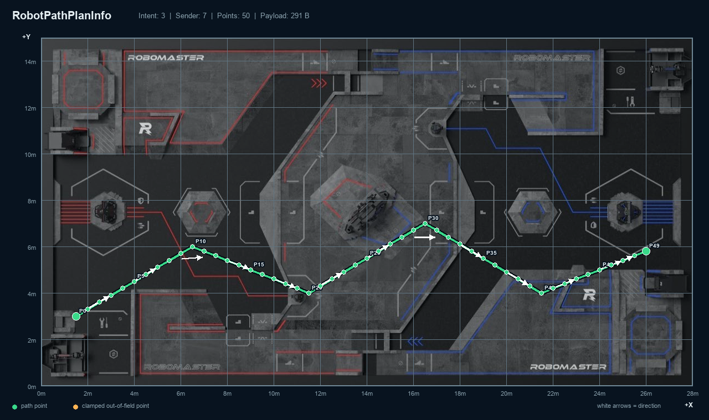

# RoboMaster 2026 哨兵轨迹自定义客户端

该程序按照《RoboMaster 2026 机甲大师高校系列赛通信协议 V2.0.0（20260626）》实现：

- MQTT TCP 连接裁判服务器 `192.168.12.1:3333`；
- 以 QoS 1 订阅 `RobotPathPlanInfo`；
- 解析 Protobuf v3 二进制载荷；
- 将 1 个起点和 49 对相邻点增量恢复为 P0～P49；
- 默认以 RMUC 2026 官方战场俯视渲染图作为背景；
- 在按 `28 m × 15 m` 校准的场地图上绘制50个点、连接折线和前进方向箭头；
- 在右侧表格显示每个点的分米和米制坐标；
- 越界点按通信协议钳制到地图边缘，并用橙色标记；
- 支持离线演示和无界面导出 PNG。

## 1. 运行环境

推荐：

```text
Windows 10/11
Python 3.10 或更高版本
```

Windows 官方 Python 通常已经包含 Tk。Linux 还需要安装 `python3-tk`。

## 2. 第一次安装

在 PowerShell 中执行：

```powershell
cd C:\0001\2026_Embedded-Sentry\custom_client_path_viewer

python -m venv .venv
.\.venv\Scripts\Activate.ps1
python -m pip install --upgrade pip
python -m pip install -r requirements.txt

Copy-Item .\config.example.json .\config.json
```

如果 PowerShell 禁止运行激活脚本，可以不激活，后续直接使用：

```powershell
.\.venv\Scripts\python.exe
```

## 3. 先运行离线演示

```powershell
.\.venv\Scripts\python.exe .\main.py --demo
```

预期结果：

- 背景显示官方 RMUC 2026 战场俯视图（左侧红方、右侧蓝方）；
- 地图中显示 P0～P49 共50个点；
- 彩色折线连接所有点；
- 白色箭头指示 P0 指向 P49 的前进方向；
- 右侧表格显示全部点的 X/Y 坐标；
- 选择表格中的点后，地图对应点会出现黄色高亮圈；
- 勾选“标注全部点号”可显示 P0～P49 的全部编号。

也可以不打开窗口，直接导出演示图：

```powershell
.\.venv\Scripts\python.exe .\main.py --export-demo .\demo_path.png
```

仓库内置的演示效果：



## 4. 实机网络配置

通信手册要求：

```text
裁判服务器 IP：192.168.12.1
MQTT TCP 端口：3333
自定义客户端 IP：192.168.12.2
```

在连接裁判系统/图传链路的网卡上配置：

```text
IPv4 地址：192.168.12.2
子网掩码：255.255.255.0
```

不要把该地址配置到无关的 Wi-Fi 网卡。配置完成后可以先检查：

```powershell
ping 192.168.12.1
Test-NetConnection 192.168.12.1 -Port 3333
```

比赛网络可能禁用 ICMP，因此 `ping` 不通不能单独证明 MQTT 不可用；应以 TCP 3333 检查和程序连接状态为准。

## 5. 修改配置

打开 `config.json`：

```json
{
  "mqtt": {
    "host": "192.168.12.1",
    "port": 3333,
    "local_bind_ip": "192.168.12.2",
    "client_id": "7",
    "topic": "RobotPathPlanInfo",
    "keepalive_seconds": 30
  },
  "map": {
    "field_width_dm": 280,
    "field_height_dm": 150,
    "background_image": "assets/rmuc_2026_official_field_map.png",
    "mirror_x": false,
    "mirror_y": false,
    "arrow_every": 4,
    "show_all_labels": false
  }
}
```

必须确认：

- 红方哨兵将 `client_id` 设置为字符串 `"7"`；
- 蓝方哨兵将 `client_id` 设置为字符串 `"107"`；
- topic 大小写必须是 `RobotPathPlanInfo`；
- 相同 `client_id` 不要同时运行两个 MQTT 客户端，否则服务器可能踢掉旧连接。

当前工程采用 `28 m × 15 m`，因此配置为 `280 dm × 150 dm`。如果赛事场地图或当赛季场地尺寸发生变化，应同步修改。

## 6. 官方场地图与坐标方向

程序已经内置：

```text
assets/rmuc_2026_official_field_map.png
```

该图取自 RoboMaster 组委会发布的《RoboMaster 2026 机甲大师超级对抗赛比赛规则手册 V1.4.0》中“图 4-1 战场俯视渲染图”。图像已裁剪至矩形战场边界，并归一化为 `1400 × 750` 像素，对应 `28 m × 15 m`。详细来源、处理方式、校验哈希和版本边界见 [assets/OFFICIAL_MAP_SOURCE.md](./assets/OFFICIAL_MAP_SOURCE.md)。

通信协议 `0x0307 map_data_t` 明确规定：

```text
小地图左下角为坐标原点
水平向右为 X 轴正方向
竖直向上为 Y 轴正方向
```

因此本程序默认作如下映射：

```text
(0 dm, 0 dm)     -> 地图左下角（红方侧）
(280 dm, 150 dm) -> 地图右上角（蓝方侧）
```

官方场地图纸页面还提供了依据 RMUC 2026 规则手册 V2.0.0 制作的 STEP 模型，并注明规则手册和现场场地优先。内置 PNG 用于轨迹可视化；机械尺寸或高精度导航标定应以最新规则图纸、官方 STEP 和现场测量为准。

若要临时替换为其他场地图：

1. 准备 PNG/JPG 场地图；
2. 将图片裁剪到场地有效边界，不能保留标题栏、图例或外边距；
3. 把图片放入本目录，例如 `assets/field_map.png`；
4. 修改配置：

```json
"background_image": "assets/field_map.png"
```

也可以运行后点击“载入场地图”，但该选择只对本次运行有效。

如果替换图片的方向相反，可使用：

```json
"mirror_x": true
```

或：

```json
"mirror_y": true
```

镜像只影响显示，不修改 MQTT 中的原始坐标和右侧坐标表。

## 7. 连接裁判服务器

完成网络和配置后运行：

```powershell
.\.venv\Scripts\python.exe .\main.py
```

点击“连接裁判服务器”。状态区应依次显示：

```text
正在连接 mqtt://192.168.12.1:3333
MQTT 已连接，正在订阅轨迹主题
已订阅 RobotPathPlanInfo（QoS 1），等待服务器触发消息
```

随后让 NUC 发布一条 `/ly/control/map_path`。完整链路为：

```text
NUC
  -> 云台板
  -> 底盘板
  -> 裁判系统 0x0307
  -> 裁判服务器
  -> MQTT RobotPathPlanInfo
  -> 本程序
```

收到消息后，地图和点位表会自动刷新。

## 8. 点位恢复规则

程序严格按 `0x0307 map_data_t` 的详细定义累加相邻点增量：

```text
P0 = (start_pos_x, start_pos_y)
P1 = P0 + (offset_x[0], offset_y[0])
P2 = P1 + (offset_x[1], offset_y[1])
...
P49 = P48 + (offset_x[48], offset_y[48])
```

单位为分米，界面同时显示：

```text
x_m = x_dm / 10
y_m = y_dm / 10
```

程序会拒绝以下错误消息并在状态栏说明原因：

- `intention` 不是 `1/2/3`；
- `offset_x` 或 `offset_y` 不是49项；
- 增量超出 `[-128, 127]`；
- 起点超出 `uint16` 范围；
- Protobuf 二进制载荷无法解析。

## 9. 运行测试

```powershell
.\.venv\Scripts\python.exe -m unittest discover -s tests -v
```

测试覆盖：

- Protobuf 编码和解析；
- 负数 `int32` 增量；
- 相邻点累加规则；
- 固定49对增量和50点输出；
- 地图渲染尺寸和轨迹颜色。

## 10. 常见问题

### MQTT 连接失败并提示无法分配地址

本机网卡没有配置 `192.168.12.2`，或配置到了错误网卡。检查：

```powershell
Get-NetIPAddress -AddressFamily IPv4
```

### 已连接但收不到消息

依次确认：

1. topic 是否严格为 `RobotPathPlanInfo`；
2. `client_id` 是否为当前连接机器人的 `7/107`；
3. NUC 是否成功发布路径；
4. NUC 日志是否出现 1 Hz 超频丢弃；
5. 云台 CAN 是否收到 `0x152` 的0～14号分片；
6. 底盘是否向裁判系统发送 `cmd_id=0x0307`；
7. `sender_id` 是否与本机机器人 ID 一致。

`RobotPathPlanInfo` 是服务器触发式发送。程序订阅成功后，如果没有新的 `0x0307` 上传，不会自动收到历史轨迹。

### 路径方向或位置反了

先检查算法是否把增量错误地理解成“全部相对起点”。本程序使用相邻点累加。若坐标正确但背景方向相反，再调整 `mirror_x/mirror_y`。

### 轨迹与背景地图存在固定偏移

背景图片没有裁剪到场地边界，或者图片包含外边距。先裁剪图片；不要通过修改轨迹坐标补偿图片问题。
